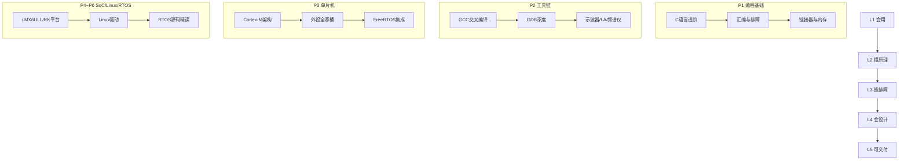

# 学习路线图：从入门到专家




<!-- more -->

## 推荐路径

| 阶段 | 篇章 | 时长 | 检验标准 |
|------|------|------|----------|
| L1 会用 | 第一篇 + 第三篇前半 | 4周 | GPIO/串口/定时器例程独立完成 |
| L2 懂原理 | 第二篇 + 第五篇 + 第三篇后半 | 6周 | 中断旅程/PendSV 切换能盲讲 |
| L3 能排障 | 全库排故表 + SO 系列 | 持续 | HardFault/Oops 1h 内定位 |
| L4 会设计 | 第八篇 + 第四/六篇架构设计 | 8周 | 需求→框图→预算表一天出稿 |
| L5 可交付 | 第九篇项目集 + S3/S4 | 12周 | 完整产品闭环交付 |

## 五板能力阶梯

```
夸克H3(极简入门) → 泰山派RK3566(RK标准流程)
→ NanoPC-T4 RK3399(大小核) → NanoPC-T6 RK3588(旗舰)
→ ZYNQ7020(异构天花板)
```
